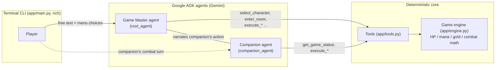

# Dungeon of the Forgotten King — a Cooperative Multi-Agent RPG

A terminal role-playing game where **two AI agents play alongside you**: a
**Game Master** agent that narrates a 7-level dungeon crawl and drives the game
engine through tool calls, and an **NPC Companion** agent that makes its own
tactical decisions in combat — taunting to protect you when your health is low,
healing you, or unleashing a Fireball.

Built for the Kaggle **AI Agents: Intensive Vibe Coding Capstone Project**
(Freestyle track) with the **Google Agent Development Kit (ADK)**, Gemini, and
`agents-cli`.

```
  _  __          ___   ___ ___   _                    _
 | |/ /___ _  _ / / | | _ | _ \ /_\  __ _ ___ _ _  __| |___
 | ' </ _ | || < <| | |   |  _// _ \/ _` / -_) ' \/ _` (_-<
 |_|\_\___/\_,_|_\|_| |_|_|_| /_/ \_\__, \___|_||_\__,_/__/
                                    |___/
```

## The problem

Classic tabletop RPGs need a human Game Master who improvises a story while
also enforcing the rules fairly. LLMs are wonderful improvisers but unreliable
accountants: left alone they hallucinate hit points, forget inventory, and let
players talk their way out of the rules. This project demonstrates the
architecture that fixes that split: **creative narration by agents, hard state
by a deterministic engine**, connected through tools.

- The **game engine** (`app/engine.py`) owns all state: HP, mana, gold, XP,
  routes, monsters, combat math. Pure Python, fully unit- and BDD-tested.
- The **agents** never mutate state directly — they can only act through
  typed **tools** (`app/tools.py`), so the narration can be flamboyant while
  the numbers stay honest.

## Multi-agent design



- **Game Master (`root_agent`)** — greets you, asks you to choose a character
  (Wizard or Fighter), sets the scene, describes the three route choices per
  level, resolves your combat actions via tools, and narrates everything.
- **Companion (`companion_agent`)** — a separate agent with its own
  instruction: it reads the party state each combat round and picks a
  *cooperative* action (Taunt when its ally is fragile, Heal under 40% HP,
  Fireball when safe), then speaks an in-character line. The GM then narrates
  the companion's action back into the shared story.
- Both agents share one game state, so neither can contradict the other's
  numbers.

### MCP server mode

The whole game engine is also exposed as a **Model Context Protocol server**
(`app/mcp_server.py`, FastMCP over stdio). Any MCP client — Claude Desktop,
MCP Inspector, or the GM agent itself — can drive the dungeon:

```bash
# Run the GM with its tools served over MCP instead of in-process:
RPG_USE_MCP=1 uv run adk web app/
# Exercise the MCP server directly:
uv run pytest tests/integration/test_mcp_server.py -v
```

In MCP mode the game state lives inside the server subprocess; the default CLI
mode keeps tools in-process so its status panels can render the party state
directly. (Design details in code comments in `app/mcp_server.py`.)

## Course concepts demonstrated

| Concept | Where |
|---|---|
| Multi-agent system (ADK) | `app/agent.py` — GM + Companion agents cooperating over shared tools |
| MCP server | `app/mcp_server.py` + `tests/integration/test_mcp_server.py` |
| Deployability | Deployed to Vertex AI Agent Runtime — see [DEPLOYMENT.md](DEPLOYMENT.md) |
| Agent skills (agents-cli) | Project scaffolded, linted, evaluated, and deployed with `agents-cli` |

## Quickstart

Prereqs: [uv](https://docs.astral.sh/uv/), the
[gcloud CLI](https://cloud.google.com/sdk/docs/install), and a GCP project
with Vertex AI enabled (the agents call Gemini through Vertex AI using your
Application Default Credentials — **no API keys anywhere in this repo**).

```bash
uv tool install google-agents-cli   # once
gcloud auth application-default login
gcloud config set project <your-project-id>

agents-cli install                  # install dependencies
uv run python -m app.main           # play!
```

The Game Master opens the game: it greets you, sets the scene, and asks you to
choose your character in plain English (e.g. *"I'll be a Wizard named
Gandalf"*). From there: pick a route (left / forward / right), fight monsters
rendered in ASCII art, watch your companion take its own tactical turns, and
descend 7 levels to reach the portal.

You can also chat with the GM agent in a browser: `agents-cli playground`.

## Tests and evaluation

```bash
uv run behave                                   # 11 BDD scenarios (Gherkin, features/)
uv run pytest tests/unit tests/integration     # engine, tools, agent, MCP round-trip
agents-cli lint                                 # ruff + formatting + type check + codespell
agents-cli eval generate && agents-cli eval grade   # LLM-as-judge evaluation
```

The behavior of the game is specified in Gherkin feature files
(`features/*.feature`) — character creation, route generation, combat math,
death, victory, and the companion's cooperative logic — executed with `behave`.

Agent quality is measured with `agents-cli eval`: a dataset of game scenarios
(`tests/eval/datasets/basic-dataset.json`) is run against the live GM agent and
graded by an LLM judge (`tests/eval/eval_config.yaml`). Latest run:
**mean 5.0 / 5** across 8 cases (results in `artifacts/grade_results/`).
The eval loop caught real bugs during development — the GM asking for
confirmation instead of executing multi-step commands (4.125 → 4.875 after
instruction fixes), and later narrating hallucinated HP numbers that
contradicted the live status panel (fixed with a no-invented-numbers rule,
reaching 5.0).

## Local end-to-end runbook

See [RUNBOOK.md](RUNBOOK.md) for a step-by-step local verification script
(install → lint → tests → BDD → MCP smoke → full playthrough → evals →
remote smoke test).

## Deployment

The GM agent deploys to **Vertex AI Agent Runtime** with one command:

```bash
agents-cli deploy
```

Reproduction steps, smoke test, and known limitations are documented in
[DEPLOYMENT.md](DEPLOYMENT.md). Deployment is wrapped by
`app/agent_runtime_app.py`, which adds Cloud Logging, Cloud Trace telemetry,
and a feedback-registration operation.

## Project structure

```
capstone-rpg/
├── app/
│   ├── agent.py            # GM + Companion ADK agents (Gemini), MCP/in-process tool wiring
│   ├── engine.py           # Deterministic game engine: state, combat math, ASCII art
│   ├── tools.py            # Typed tool layer between agents and engine
│   ├── mcp_server.py       # FastMCP server exposing the engine over MCP (stdio)
│   ├── main.py             # Terminal game loop (rich UI)
│   └── agent_runtime_app.py# Agent Runtime (Vertex AI) wrapper + telemetry
├── features/               # Gherkin BDD specs + behave steps
├── tests/
│   ├── unit/               # Engine + tool unit tests
│   ├── integration/        # Live agent stream test, MCP round-trip test
│   └── eval/               # Eval dataset + LLM-judge config
├── deployment/terraform/   # Optional infra-as-code (single-project setup)
├── RUNBOOK.md              # Local end-to-end verification steps
├── DEPLOYMENT.md           # GCP deployment reproduction guide
└── SUBMISSION_CHECKLIST.md # Kaggle submission checklist
```

## Security notes

- No API keys, passwords, or credentials in the repository — authentication is
  Application Default Credentials only (`google.auth.default()`).
- Agents cannot mutate game state except through the typed tool layer, which
  validates inputs (class names, route directions, item names) and returns
  structured errors instead of raising.
- `.env` files are git-ignored; deployment configuration comes from gcloud
  project settings.
